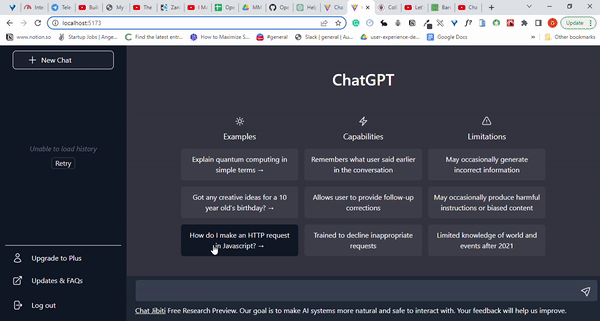

ChatJibiti
-----

### Introduction

Jibiti is a play on the word GPT in Yoruba and chatjibiti is a clone of the "man's best friend" ChatGPT. This project drove me to lengths to learn concepts and deal with the pressure of a looming deadline. The site allows you to send a prompt to chatGPT and you get a response whether the definition of photosynthesis or you want it to give you a lullaby to sing your dear one to sleep.

This project involved building a responsive webpage using React and Tailwind CSS. It also required connecting using the OpenAI API to the Davinci 003 Model of chatGPT to get a response to your prompt.

### Overview
ChatJibiti is a platform that you can tell anything and it will give you information that makes your life easier, faster and better in one breath.

- It has a "give it a prompt and it will give you a response" feature
- It has a loading spinner feature while the OpenAI API gets ready to serve you the response
- It has an Error Boundary such that if there is an error in the API fetch, the error is caught
- If you click on the New Chat button, it deletes the chat history and starts you afresh
- Clicking the examples of prompts will put the prompt in your input for you to try

### Demo


### Tech Stack

- **React** - Framework for website functionality
- **Tailwind CSS** - Styling the page
- **OpenAI API** - API for getting a response from Chat GPT

### Main Files: Project Structure

  ```sh
  ├── index.html
  ├── gitignore
  ├── package.lock-json
  ├── package.json
  ├── postcss.config.cjs
  ├── tailwind.config.cjs
  ├── vite.config.js
  ├── src
  │   ├── assets
  │   ├── App.jsx 
  │   ├── App.css
  │   ├── index.css
  │   └── main.css
  └── components
      ├── Chat - contains the footer of the page and bears the input section
      ├── ChatHistory - contains the chat that is shown when you have used the input
      ├── Footer - this is the footer of the sidebar
      ├── Hero - this holds the initial text of the main page before you start gisting with ChatJibiti
      ├── Main - holds the hero and chat and navbar
      ├── Navbar - is seen on mobile
      ├── Sidebar - is toggled on mobile and appears by default on desktop
      └── useWindowSize - a custom hook to check the window screen size
  ```

Overall:
* Structure and Logic is located in the components.
* API logic is located in `app.jsx`.

### Development Setup

1. Clone the repo

```
$ git clone https://github.com/Opeyimika-sudo/chatjibiti.git chatJibiti
$ cd chatJibiti
```

2. Install the dependencies:

```
$ npm install
```

3. Run the development server:

```
$ npm run dev
```

4. Navigate to Home page [http://localhost:5173](http://localhost:5173)

### Potential Additional Features
  
1. Write tests using Jest for the app
2. Keep an history of the prompts and responses if the user wants to retrace/reverse


